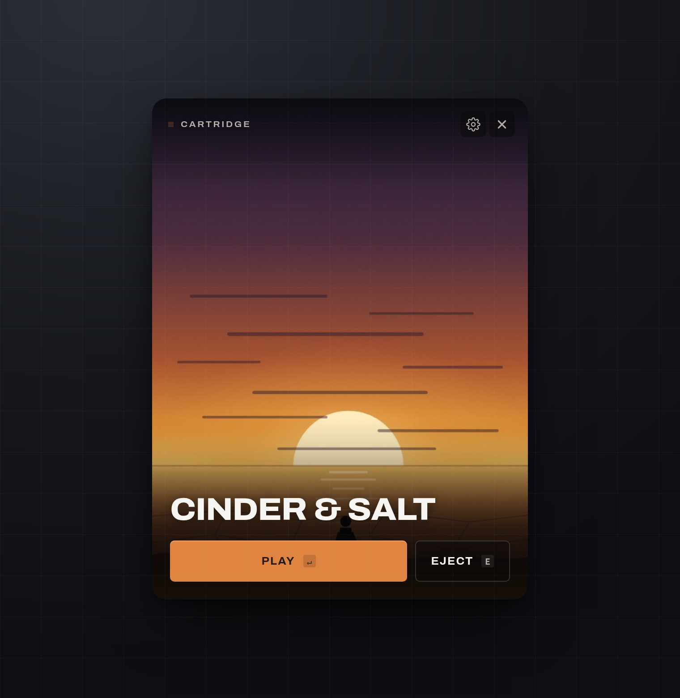
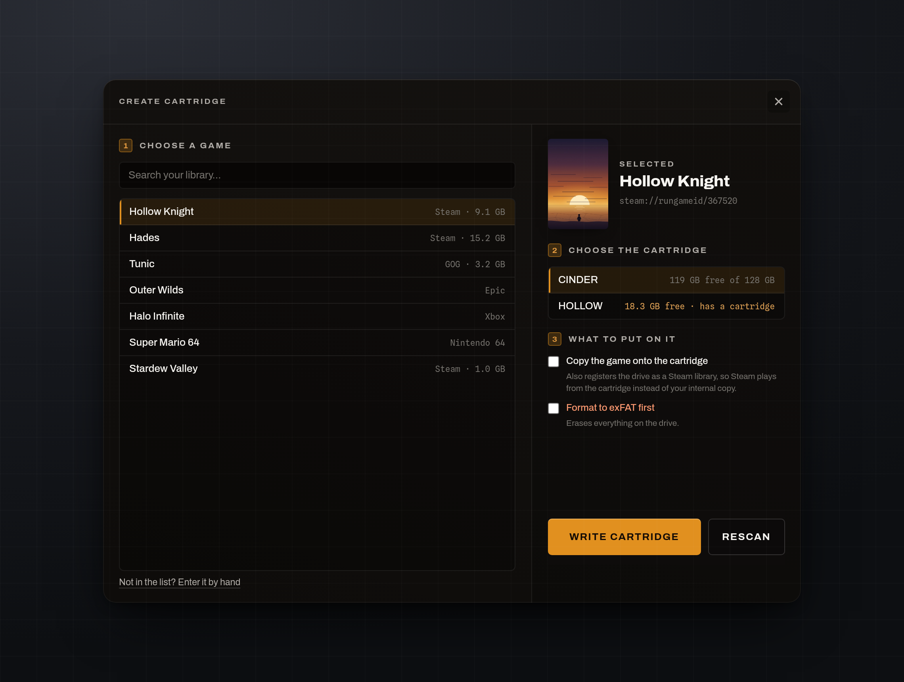
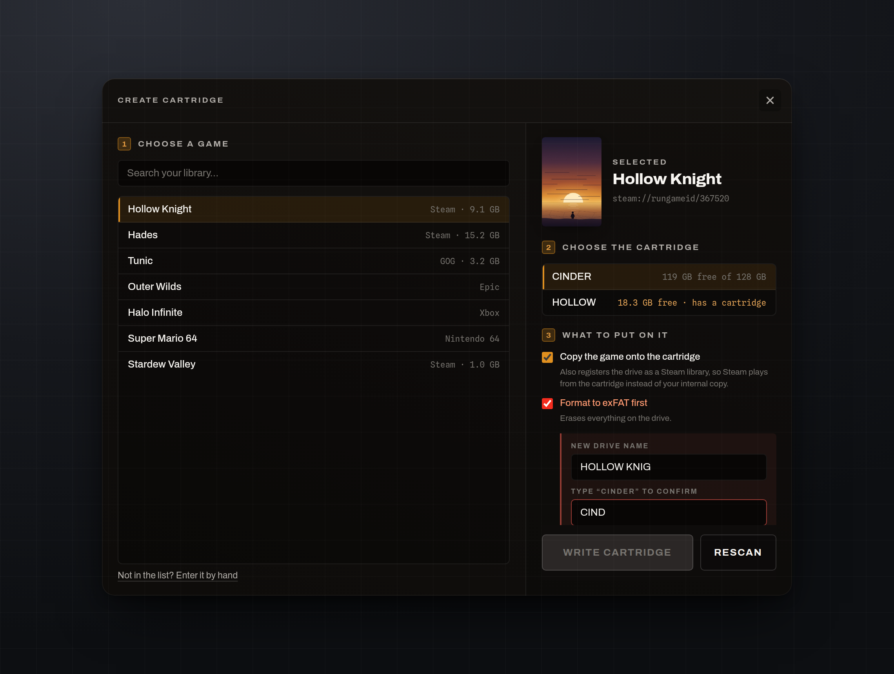

# NVMe Game Cartridges

Turn NVMe drives into physical game cartridges. Plug one in, and a launcher pops
up with the game's cover art and two buttons: **Play** and **Eject**.



Each cartridge is just a drive with a `cartridge.conf` at its root naming the
game. There are no scripts to write and nothing to allowlist.

## How it works

```
drive plugged in
      │
      ├─ Linux    udev rule ──▶ systemd unit ──▶ helper waits for the mount
      └─ Windows  watcher (resident, ~2 MB) sees the volume arrive
      │
      ▼
is there a cartridge.conf at the root?   ──no──▶  nothing happens
      │ yes
      ▼
launcher opens with the cover art
      │
      ├─ Play   ──▶ starts what cartridge.conf names, then closes
      └─ Eject  ──▶ flushes, unmounts, powers the drive down
```

Nothing on the cartridge is executed automatically. The launcher shows you what
it found and waits — pressing Play is the gate.

The same binary runs the wizard that makes cartridges, with `--create`. Only one
window is ever built, so neither mode costs anything while you are using the
other.

### Idle cost

The point is that this costs nothing while you are not using it.

| | Idle |
|---|---|
| **Linux** | **nothing resident.** udev is already part of the OS; the rule adds no process. The launcher exists only while its window is open. |
| **Windows** | **one small process, ~2 MB.** `pc-cartridge-watcher.exe` blocks on the Windows message queue, so it uses no CPU until a volume arrives. |

The launcher itself is a webview, so it is not small while it is on screen —
expect roughly 100 MB for the few seconds it is up, then it exits and gives all
of it back. There is no tray icon and no background service for the UI.

## Hardware

Built around **NVMe drives in USB-C enclosures**. Small capacities are ideal —
128 GB holds most single games, and the drive's whole job is to be one cartridge.

It works with any removable storage the OS will automount: SATA SSDs in docks,
SD cards, USB sticks, external HDDs. Nothing here is specific to NVMe beyond the
form factor being pleasant to handle.

**Filesystem:** exFAT if you want the cartridge to work on both Windows and
Linux. NTFS or ext4 are fine for one OS.

**Platforms:** Windows and Linux. macOS is not supported — there is no watcher,
no installer and no icon set for it, so rather than ship something half-working
the macOS branches were removed.

## Setup

### Prerequisites

Rust (stable) and Node 18+, plus a C toolchain for your platform.

```bash
# Linux
sudo apt install libgtk-3-dev libwebkit2gtk-4.1-dev librsvg2-dev libssl-dev

# Windows: Visual Studio Build Tools, "Desktop development with C++"
```

### Build and install

```bash
git clone https://github.com/HarryBMa/nvme-cartridge.git
cd nvme-cartridge

# The launcher, on both platforms
cd tauri-ui && npm install && npm run build && cd ..
```

**Linux**

```bash
./cartridge-linux.sh     # → 1) Install
```

Installs the udev rule, the systemd template unit, the mount helper and the
launcher binary.

**Windows**

```powershell
cd watcher; cargo build --release; cd ..
# Right-click cartridge-windows.ps1 → Run with PowerShell → 1) Install
```

Installs the watcher and launcher to `%LOCALAPPDATA%\PC-Cartridge-System` and
registers a logon task to start the watcher.

## Making a cartridge

Run the installer menu and choose **Create a cartridge**, or start it directly:

```bash
pc-cartridge-launcher --create
```



It lists everything installed. **Playnite** is read first when it is present —
that covers Steam, GOG, Epic, Xbox, Ubisoft, itch and emulators in one list —
and Steam's own manifests are read too, which is also the only source on Linux.
Cover art comes from Playnite's or Steam's local cache, so nothing is fetched.

Pick a game, pick the drive, choose what goes on it, press Write. The wizard can:

- **write the launcher files** — `cartridge.conf` plus the cover art (always);
- **name the drive** — an `autorun.inf` with `label=`, so Explorer shows
  "HOLLOW KNIGHT" instead of "Removable Disk (D:)", and `icon=` when a usable
  `.ico` can be produced;
- **copy the game onto the cartridge**, by whichever route suits it:
  - *Steam games* go into `steamapps/` and the drive is registered in Steam's
    `libraryfolders.vdf`, so Steam plays *from* the cartridge rather than your
    internal copy. Close Steam first — it rewrites that file on exit.
  - *Everything else* (GOG, itch, emulator builds, anything Playnite knows the
    install folder for) is copied to `Games/<title>/` and Play is pointed at a
    file inside it. No launcher in the middle: the cartridge really does carry
    the game. The wizard ranks the executables it finds and offers the best
    guess, which you can change;
- **format the drive to exFAT**, off by default.

Games not in any library can be entered by hand with any supported URI.

### Formatting erases the drive

Formatting is opt-in per cartridge and gated four ways: the target must be on the
removable-drive allowlist the wizard re-derives itself, it must not be the system
drive, and you must type the drive's **current** name back exactly before Write
is even enabled.



The wizard only ever writes to the drive you picked — it re-checks the target
itself rather than trusting the window, so it cannot be pointed at your system
disk.

### By hand

A cartridge is just a text file, so you can skip the wizard. Copy
`cartridge.conf.example` to the root of the drive as `cartridge.conf`:

```ini
executable=steam://rungameid/1091500
title=Cyberpunk 2077
cover=cover.jpg
```

Drop a `cover.jpg` next to it — portrait art at 3:4 fills the launcher window
exactly. That is the entire cartridge:

```
NVME-DRIVE/
├── cartridge.conf
├── cover.jpg
├── autorun.inf          (written by the wizard: drive name and icon)
├── Games/               (a copied non-Steam game)
│   └── Tunic/
│       └── TUNIC.exe
└── steamapps/           (a copied Steam game)
    ├── appmanifest_367520.acf
    └── common/Hollow Knight/
```

Then unplug it and plug it back in.

`executable=` takes any URI the OS can handle (`steam://`, `heroic://`, `gog://`,
`epic://`, `playnite://`, `lutris://`, `http://`, `https://`) or a path to a file
on the cartridge. See `cartridge.conf.example` for the full list of keys.

A classic `autorun.inf` is also read, for `label` and `icon` only. Its `open=`
and `shellexecute=` keys are deliberately ignored — Windows has ignored them on
non-optical media since Windows 7, and they are the oldest autorun malware vector
there is.

## Security

Nothing on a cartridge runs without a click. That is the whole model, and it is
why there is no trust list, no SHA-256 allowlist and no auto-launch toggle —
earlier versions auto-executed a `launch.sh` on insert, which needed an allowlist
to be safe at all.

What that leaves:

- **Play runs what `cartridge.conf` says.** If `executable=` points at a binary
  on the drive, Play runs that binary. On your own cartridges that is the
  feature. On a drive someone hands you, read the conf first — or keep to
  `steam://`-style URIs, where the argument goes to a program you already trust.
- **The launcher window cannot read your disk.** The webview has no filesystem
  access and no command that takes a path. The cover is read in Rust, from a path
  confined to the cartridge, and passed in as a `data:` URI.
- **Nothing is fetched.** Fonts are bundled, the cover is inlined, and the
  content-security policy is `default-src 'self'`.
- **A plugged-in cartridge shows a window.** Detection reads
  `cartridge.conf` — a text file — and draws the title. Titles are inserted as
  text, never as markup.
- **Eject asks twice when the game lives on the cartridge.** Pulling a drive a
  running game is reading from is a different mistake to pulling one that holds
  only a text file, so the launcher says so before doing it.

### Cartridges in Steam's library list

A cartridge you copied a game onto is registered in Steam's
`libraryfolders.vdf`, labelled `PC Cartridge`. Those entries are never removed
automatically: a cartridge is *meant* to spend most of its life unplugged, so a
missing folder is the normal state rather than stale cruft. When you reformat or
repurpose one, the wizard offers **Remove this drive from Steam's library list**
for the selected drive. Steam must be closed — it rewrites that file on exit.

## Layout

```
cartridge-linux.sh          installer menu (Linux)
cartridge-windows.ps1       installer menu (Windows)
cartridge.conf.example      the one file a cartridge needs
linux/                      udev rule, systemd units, mount + eject helpers
windows/                    install / uninstall / eject scripts
core/                       cartridge logic, no UI — this is where the tests are
watcher/                    resident volume watcher (Windows only, Rust)
tauri-ui/                   one binary, two windows (Tauri 2 + Rust, no framework)
  index.html                the launcher popup
  create.html               the create-cartridge wizard
  src/tokens.css            palette and type shared by both
tools/                      icon generation, DOM-id check
docs/                       screenshots
```

## Working on it

The logic lives in `core/` (crate `cartridge-core`), deliberately free of any UI
dependency, so the tests run anywhere:

```bash
cargo test --manifest-path core/Cargo.toml     # 81 tests, no webkit needed
```

That split is the point: the Tauri binary cannot be compiled without webkit2gtk
and a display, so tests living inside it could not run in CI or on a
contributor's machine.

CI runs that suite plus clippy and rustfmt, compiles the watcher on Linux and
Windows, `cargo check`s the launcher on both, parses the frontend JavaScript, and
verifies every element the scripts reach for exists in the HTML — the UI ships
unbundled, so a missing id is a runtime crash rather than a build error.

## Uninstall

Run the installer menu and choose Uninstall. It removes the udev rule and
systemd units (Linux), or the logon task and install folder (Windows).

## Disclaimer

A hobby project, not affiliated with Valve or Steam.

Auto-detection depends on your OS automounting removable drives. Some setups need
that configured before any of this works.

Use at your own risk.
