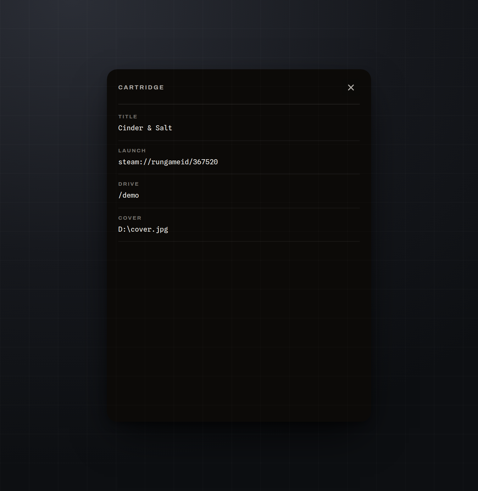

# PC GamePak — Tauri UI

A compact popup that appears when a cartridge is inserted.
Built with **Tauri 2.0** (Rust backend) and plain HTML/CSS/JS — no framework, no
bundler, no network access at runtime.


The window is 420 × 560 — the 3:4 of a cover — and the cover art fills it. Only
three things sit on top: what the cartridge is, **Play**, and **Eject**.
Everything the launcher knows beyond that lives behind the gear:



### Design notes

- **The accent colour is sampled from the cover art** at load, so the Play
  button belongs to whatever game is in the dock. Each pixel is weighted by its
  own saturation squared and biased toward the lit areas, because a flat average
  of any cover is mud. The ink on the button is then chosen for contrast against
  that colour, so the label stays readable whatever the artwork is.
- **The scrim behind the title is deliberately short.** It has to carry the
  title and the buttons and nothing else; a tall, soft gradient would dim the
  half of the artwork people actually look at.
- **Nothing is fetched.** Fonts are bundled as woff2 and the cover is passed in
  as a `data:` URI, so the CSP can stay at `default-src 'self'` and the Tauri
  asset protocol stays switched off.

### Keyboard

| Key | Action |
|-----|--------|
| `Enter` | Play |
| `E` | Eject |
| `I` | Toggle details |
| `Esc` | Close details, or dismiss the window |

## Previewing without a cartridge

The page serves a sample cartridge when it is opened outside Tauri, so the
window can be worked on without a physical drive:

```bash
npx http-server tauri-ui/app     # → http://localhost:8080/?drive=/demo
```

Append `&state=noexec` to see the case where `cartridge.conf` sets no
`executable`.

## Prerequisites

### Windows
- [Rust](https://rustup.rs/) (stable)
- [Node.js](https://nodejs.org/) 18+
- [Visual Studio Build Tools](https://visualstudio.microsoft.com/visual-cpp-build-tools/) (C++ workload)

### Linux
```bash
sudo apt install libgtk-3-dev libwebkit2gtk-4.1-dev libappindicator3-dev \
                 librsvg2-dev libssl-dev
```

## Build & run

```bash
cd tauri-ui
npm install
npm run build     # → src-tauri/target/release/pc-gamepak
npm run dev       # run it against a drive, for development
```

There is no bundler: the files in `app/` are shipped as-is, which is why
`frontendDist` points there. It is a directory of its own rather than the whole
of `tauri-ui/`, because Tauri embeds everything under `frontendDist` into the
binary — including, if it were allowed to, `src-tauri/target/`.

## The create-cartridge wizard

The same binary, started with `--create`, opens the wizard that writes
cartridges:

```bash
pc-gamepak --create
```


Only one window is ever built — `main()` looks at the arguments and constructs
either the popup or the wizard, never both, so neither mode costs memory while
the other is in use.

The game list comes from **Playnite** where it is installed — one list covering
Steam, GOG, Epic, Xbox, Ubisoft, itch and emulators — read from a JSON export,
since Playnite's own library is a LiteDB file. Steam's `appmanifest_*.acf` files
are read too, across every folder in `libraryfolders.vdf`; that is the only
source on Linux. Art comes from whichever cache the game came from. Nothing is
fetched, and games mid-download are skipped, since a cartridge pointing at a
partial install cannot play.

Covers are loaded one at a time as you select a game: base64ing a whole library
into the webview at once would be tens of megabytes of IPC.

The wizard can also format the cartridge to **exFAT** or **btrfs**, copy a
Steam game onto it and register it in Steam's `libraryfolders.vdf`, and write an
`autorun.inf` so Explorer shows the game's name instead of "Removable Disk".
Formatting is opt-in and gated on typing the drive's current name back. exFAT is
the default, because it reads on any machine with no driver to install; btrfs is
there for enthusiasts who want TRIM and compression and can live with needing
WinBtrfs on Windows.

## Icon

`src-tauri/icons/` is generated, not hand-drawn. The sources are two SVGs:

- `icon.svg` — the full mark, with the wordmark set in Archivo
- `icon-small.svg` — the same shell with wider diagonals and no text, used at
  48px and below, where the wordmark degrades into an illegible grey bar

Edit those, then regenerate the PNGs and the multi-resolution `.ico`:

```bash
node tools/make-icons.mjs
```

The rasteriser inlines the SVG into a page that declares the bundled Archivo
face, because an SVG loaded as an `` is sandboxed and cannot fetch fonts —
left to itself the wordmark would render in whatever the build machine had.

There is no `.icns`, so `bundle.targets` lists the Windows and Linux bundles
only.

## When nothing happens

The Windows watcher writes to
`%LOCALAPPDATA%\PC-GamePak\watcher.log`, which is the first place to
look when a cartridge does not open the launcher — it records every volume
arrival and why each one was or was not acted on. The Linux helper logs to
`~/.local/state/pc-gamepak/helper.log`.

## How it gets started

The launcher takes the cartridge's mount point on the command line and shows one
cartridge per window:

```bash
pc-gamepak --drive /run/media/you/CARTRIDGE   # Linux
pc-gamepak.exe --drive "D:\"                  # Windows
```

Nothing on the cartridge invokes it. On Linux a udev rule starts
`linux/gamepak-launcher-helper.sh`, which waits for the automount and then runs
the launcher; on Windows `watcher/` sees the volume arrive and does the same. See
the [main README](../README.md) for the full path.

The window exits after Play, Eject or dismiss, so nothing stays resident.

## Cartridge format

Place a `cartridge.conf` at the root of the SSD:

```ini
executable=steam://rungameid/1091500
title=Cyberpunk 2077
cover=cover.png
```

Or use a classic `autorun.inf`:

```ini
[autorun]
label=Cyberpunk 2077
open=Game\bin\game.exe
icon=cover.png
```

Supported URI schemes: `steam://`, `heroic://`, `gog://`, `epic://`,
`playnite://`, `lutris://`, `http://`, `https://`.

## Project layout

```
tauri-ui/
├── app/                        # everything shipped to the webview
│   ├── index.html              # Main HTML shell
│   ├── create.html             # The create-cartridge wizard
│   └── src/
│       ├── main.js             # Launcher logic (Tauri invoke calls)
│       ├── create.js           # Wizard logic
│       ├── style.css           # Popup styles
│       ├── create.css          # Wizard styles
│       ├── fonts/              # Bundled woff2 (Archivo, Spline Sans Mono)
│       └── demo/               # Sample cover art for browser preview
├── src-tauri/
│   ├── Cargo.toml
│   ├── build.rs
│   ├── tauri.conf.json
│   ├── capabilities/
│   │   └── default.json        # Tauri 2.0 capability file
│   ├── icons/                  # generated by tools/make-icons.mjs
│   │   ├── icon.svg            #   full mark (source)
│   │   └── icon-small.svg      #   simplified mark for <=48px (source)
│   └── src/
│       └── main.rs             # commands and window construction only
└── package.json
```

The logic behind those commands lives in the `gamepak-core` crate at `core/`,
which has no UI dependency so its tests run without a webview:

```
core/src/
├── cartridge.rs   reading a cartridge: manifest, cover, holds_game
├── playnite.rs    Playnite library import
├── steam.rs       Steam manifests and library folders
├── steamlib.rs    copy a game, register/unregister with Steam
├── drives.rs      which drives may be written to
├── format.rs      exFAT / btrfs formatting, behind confirmation
├── autorun.rs     autorun.inf, drive name and icon
└── create.rs      the build pipeline
```

## Security note

The eject command uses `DeviceIoControl` (Windows) or `udisksctl` (Linux) to
safely flush write caches before the drive is powered off.  Always use the
**Eject** button rather than pulling the cartridge directly.
